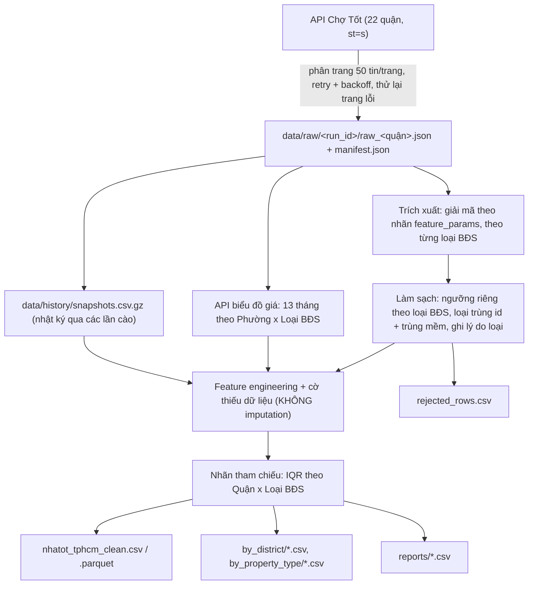

# BÁO CÁO THU THẬP & TIỀN XỬ LÝ DỮ LIỆU BẤT ĐỘNG SẢN TP.HCM (NHÀ TỐT / CHỢ TỐT)
**Đồ án tốt nghiệp Data Science**
- **Đề tài:** Dự đoán giá (Price Prediction) & Phát hiện bất thường (Anomaly Detection / Đánh giá cơ hội đầu tư)
- **Nguồn dữ liệu:** Nhà Tốt (`nhatot.com`) - Chợ Tốt (`chotot.com`), API công khai `gateway.chotot.com/v1/public/ad-listing`
- **Phạm vi địa lý:** 22 Quận / Huyện / TP Thủ Đức của TP.HCM **theo địa giới cũ** (trước sáp nhập 01/07/2025; không gồm Bình Dương, Bà Rịa - Vũng Tàu cũ). Dữ liệu giữ cả tên phường cũ (`ward_name`) và phường mới (`ward_name_new`).
- **Loại BĐS:** Căn hộ/chung cư, Nhà ở, Đất (loại văn phòng/mặt bằng kinh doanh bị loại khỏi dataset sạch).
- **Khung thời gian:**
  - Tin rao: tin đang rao (`status=active`, ~60 ngày) + tin đã gỡ / hết hạn (`status=deleted`, lấy qua tham số `include_expired_ads=true`, lùi thêm khoảng 1 tháng). API không trả tin cũ hơn. Mỗi lần cào là một *ảnh chụp (snapshot)* thị trường; cần **cào định kỳ** (khuyến nghị hàng tuần) để tích lũy dữ liệu theo thời gian (`data/history/snapshots.csv.gz`).
  - Lịch sử giá khu vực: lấy từ API biểu đồ giá của Nhà Tốt, **13 tháng gần nhất** theo Phường x Loại BĐS (cột `bieu_do_gia` như bộ dữ liệu mẫu của giảng viên).
- **Đối chiếu bộ dữ liệu mẫu** (`Cung cap HV/`: nhà ở, 3 quận Bình Thạnh / Phú Nhuận / Gò Vấp, 23 cột): dataset này bao phủ đủ 22 quận, 3 loại BĐS và có đủ các cột của mẫu (xuất thêm theo đúng tên cột tại `data/processed/dinh_dang_mau/`), trừ `dien_thoai` (số điện thoại cá nhân, không thu thập).

---

## 1. Mục tiêu bài toán

1. **Dự đoán giá (Slide 3):** mô hình ước lượng giá dựa trên diện tích, số phòng, số tầng, loại hình, mặt tiền/hẻm, pháp lý, nội thất, vị trí (quận, phường, đường, tọa độ), dự án...
2. **Phát hiện bất thường & cơ hội đầu tư (Slide 4):** tìm tin có giá thấp hơn đáng kể so với mức tham chiếu nhưng pháp lý an toàn.
3. **Phạm vi giai đoạn này:** thu thập dữ liệu + chuẩn bị dữ liệu (chưa làm mô hình).

---

## 2. Kiến trúc Pipeline



### 2.1. Điểm quan trọng trong thiết kế

| Vấn đề | Cách xử lý |
| :--- | :--- |
| Mã pháp lý & đặc điểm (`pty_characteristics`) **cùng số nhưng khác nghĩa theo loại BĐS** (vd. mã 6 = "Sổ hồng riêng" với căn hộ nhưng "Giấy tờ viết tay" với nhà/đất) | Ưu tiên nhãn chữ trong `feature_params` của API; bảng mã dự phòng tách theo loại BĐS (`src/config.py`) |
| Đơn giá/m² không so sánh được giữa căn hộ (m² sàn), nhà (m² đất), đất | Ngưỡng làm sạch, nhóm tham chiếu IQR và báo cáo đều tách theo **Quận x Loại BĐS** |
| Một BĐS được nhiều môi giới đăng lại | Loại "trùng mềm": cùng loại, phường, giá, diện tích, số phòng, số tầng, tầng căn hộ → giữ tin đăng sớm nhất; số tin trùng lưu ở `n_duplicate_posts` |
| Điền thiếu trước khi chia train/test gây rò rỉ; điền phòng ngủ cho đất là sai | Giữ NaN, thêm cờ `*_missing`; trường không áp dụng (phòng ngủ của đất, số tầng của căn hộ) để NaN |
| Tin "đẩy" có `list_time` mới nhưng đăng từ lâu | Dùng `orig_list_time` làm ngày đăng thật, tính `days_on_market` |
| Lỗi mạng làm mất dữ liệu âm thầm | Trang lỗi được thử lại; quận thiếu được đánh dấu `partial` trong `manifest.json`, có thể cào bổ sung vào cùng `run_id` |

---

## 3. Quy tắc làm sạch

| Bước | Quy tắc |
| :--- | :--- |
| 1 | Loại trùng `ad_id` |
| 2 | Loại loại BĐS ngoài phạm vi (văn phòng, mặt bằng) |
| 3 | Loại tin Chợ Tốt đánh dấu `is_price_not_valid` |
| 4 | Loại tin thiếu giá / diện tích / quận |
| 5 | Ngưỡng theo loại BĐS (giá VNĐ, diện tích m², đơn giá triệu/m²):<br>• Căn hộ: 0,3–200 tỷ; 15–500 m²; 10–800 tr/m²<br>• Nhà ở: 0,3–1.000 tỷ; 8–10.000 m²; 1–2.000 tr/m²<br>• Đất: 0,1–1.000 tỷ; 20–500.000 m²; 0,2–2.000 tr/m² (giữ được đất nông nghiệp ngoại thành) |
| 6 | Nhà có diện tích sử dụng > 20 lần diện tích đất (nhập sai) |
| 7 | Trùng mềm (xem 2.1) |

Đơn vị hecta (`size_unit = 2`) được quy đổi sang m². Mọi dòng bị loại được lưu kèm lý do trong `data/processed/rejected_rows.csv`.

---

## 4. Danh mục biến (`nhatot_tphcm_clean.csv`)

**Định danh & thời gian**

| Biến | Mô tả |
| :--- | :--- |
| `ad_id` | Mã tin (list_id) – khóa chính |
| `run_id`, `crawled_at` | Lần cào và thời điểm cào |
| `list_time`, `orig_list_time` | Thời điểm hiển thị (có thể do đẩy tin) / thời điểm đăng gốc |
| `days_on_market` | Số ngày từ lúc đăng gốc tới lúc cào (chỉ tin đang rao) |
| `is_bumped` | 1 nếu tin đã được đẩy lại |
| `listing_status`, `is_removed` | `active` = đang rao; `deleted` = đã gỡ / hết hạn (đã bán hoặc ngừng rao) |
| `post_year`, `post_month` | Theo ngày đăng gốc |
| `first_seen_at`, `n_snapshots`, `first_seen_price`, `price_change_pct` | Từ nhật ký snapshot: lần đầu thấy tin, số lần cào thấy tin, giá lần đầu, % thay đổi giá |

**Phân loại BĐS**

| Biến | Mô tả |
| :--- | :--- |
| `property_type` | `can_ho` / `nha_o` / `dat` |
| `category_id`, `category_name` | Danh mục gốc của Chợ Tốt |
| `house_type` | Nhà mặt phố / ngõ hẻm / biệt thự / phố liền kề (nhà ở) |
| `apartment_type` | Chung cư / mini / duplex / penthouse / tập thể / officetel (căn hộ) |
| `land_type` | Thổ cư / nền dự án / công nghiệp / nông nghiệp (đất) |
| `project_id`, `project_name`, `has_project` | Dự án (rất quan trọng với căn hộ) |
| `property_status` | Đã / chưa bàn giao (căn hộ) |

**Vị trí**

| Biến | Mô tả |
| :--- | :--- |
| `district_id`, `district_name`, `district_type` | Quận/huyện (địa giới cũ) và nhóm inner / suburban / rural / satellite_city |
| `ward_id`, `ward_name`, `ward_name_new` | Phường/xã cũ và phường/xã mới sau sáp nhập |
| `street_name`, `street_id`, `street_number`, `is_main_street` | Đường, mã đường, số nhà, nằm trên trục đường chính |
| `is_alley_address` | 1 nếu số nhà có dạng hẻm (`94/8`) |
| `latitude`, `longitude` | Tọa độ (chỉ chính xác tới mức đường / phường) |
| `geo_precision` | `street` = tâm con đường · `ward` = tâm phường (1 điểm dùng chung cho nhiều đường) · `none` = không có / ngoài TP.HCM |

**Giá & diện tích**

| Biến | Mô tả |
| :--- | :--- |
| `price`, `price_billion` | Giá rao (VNĐ / tỷ) – **biến mục tiêu** |
| `size` | Diện tích đất (nhà, đất) hoặc diện tích căn (căn hộ), m² |
| `living_size`, `total_floor_area_est` | Diện tích sử dụng / ước tính tổng sàn (nhà ở) |
| `width`, `length` | Ngang, dài (m) |
| `price_per_m2`, `price_per_m2_living` | Đơn giá theo `size` / theo diện tích sử dụng (triệu/m²) |
| `chotot_price_per_m2` | Đơn giá do Chợ Tốt tính (đối chiếu) |
| `price_segment` | Bình dân < 3 tỷ, Trung cấp 3–7, Cao cấp 7–15, Hạng sang ≥ 15 |

**Đặc điểm**

| Biến | Mô tả |
| :--- | :--- |
| `rooms` (11 = "hơn 10"), `toilets`, `floors`, `floor_number`, `block` | Cấu trúc |
| `direction`, `balcony_direction` | Hướng cửa chính / ban công |
| `furnishing` | Nội thất cao cấp / đầy đủ / hoàn thiện cơ bản / bàn giao thô |
| `legal_document`, `legal_group`, `has_secure_legal` | Pháp lý gốc; nhóm chuẩn hóa (`co_so_rieng`, `cho_so`, `so_chung_vi_bang`, `hop_dong`, `giay_tay`, `khong_so`, `khac`); 1 nếu có sổ riêng |
| `char_*` | Cờ đặc điểm có cấu trúc: `mat_tien`, `hem_xe_hoi`, `no_hau`, `top_hau`, `dinh_quy_hoach`, `chua_hoan_cong`, `nha_nat`, `tho_cu_toan_bo`, `tho_cu_1_phan`, `chua_co_tho_cu`, `khong_tho_cu`, `dat_chua_chuyen_tho`, `hien_trang_khac` |
| `is_frontage` | 1 nếu nhà mặt phố hoặc có cờ mặt tiền |
| `txt_mat_tien`, `txt_hem_xe_hoi` | Tín hiệu phụ trích từ tiêu đề/mô tả (đã loại "gần/sát/cách mặt tiền") |
| `subject`, `body` | Văn bản gốc (dùng cho NLP nếu cần) |
| `address` | Địa chỉ đầy đủ (đường, phường, quận cũ + phường mới) |
| `unit_number`, `block` | Mã căn, phân khu / lô (căn hộ, đất dự án) |

**Giá khu vực (biểu đồ giá Nhà Tốt, cấp phường)** – dùng được làm biến vị trí và để so sánh khu vực đầu tư

| Biến | Mô tả |
| :--- | :--- |
| `bieu_do_gia` | Chuỗi JSON 13 giá trị: đơn giá trung vị (triệu/m²) theo tháng của phường, đúng phân nhóm của tin (nhà hẻm / mặt phố; căn hộ đã / chưa bàn giao; đất thổ cư / nông nghiệp...) |
| `area_chart_title` | Tên biểu đồ được dùng |
| `area_median_price_per_m2` | Đơn giá trung vị tháng gần nhất của khu vực |
| `area_mom_change_pct`, `area_yoy_change_pct` | Biến động so với tháng trước / cùng kỳ năm trước (Nhà Tốt tính) |
| `area_12m_growth_pct` | Tăng trưởng giữa điểm đầu và cuối chuỗi 13 tháng |
| `area_growth_smoothed_pct` | Trung bình 3 tháng cuối so với 3 tháng đầu (ít nhiễu hơn) |

Bảng dài đầy đủ theo tháng: `data/processed/market_price_monthly.csv` (phường x loại BĐS x phân nhóm x tháng). Lưu ý: số liệu cấp phường có thể dao động mạnh giữa các tháng khi ít tin, nên dùng trung bình trượt hoặc gộp lên cấp quận khi phân tích xu hướng.

**Người đăng & chất lượng tin**

| Biến | Mô tả |
| :--- | :--- |
| `account_id` | Người đăng (dùng GroupKFold để tránh rò rỉ giữa train/test) |
| `is_company_ad`, `is_shop`, `is_verified` | Môi giới / trang cửa hàng / đã xác thực |
| `seller_live_ads`, `seller_sold_ads` | Số tin đang đăng / đã bán của người đăng |
| `number_of_images`, `has_video`, `is_sticky` | Chất lượng & quảng cáo tin |
| `n_duplicate_posts` | Số tin (của nhiều người) trùng cùng một BĐS |
| `size_dim_mismatch` | 1 nếu diện tích lệch ngang × dài quá 2 lần |
| `rent_million_per_month`, `gross_rental_yield_pct` | Giá thuê trích từ mô tả ("đang cho thuê 40tr/tháng") và tỷ suất cho thuê gộp %/năm (nêu kèm giá nên không dùng làm biến đầu vào mô hình giá) |

**Cờ thiếu dữ liệu:** `*_missing` cho `rooms, toilets, floors, width, length, living_size, legal_group, direction, furnishing, latitude`.

**Nhãn tham chiếu (chỉ dùng cho EDA / làm nhãn so sánh, KHÔNG dùng làm biến đầu vào mô hình giá vì được tính từ chính giá bán → rò rỉ dữ liệu):**

| Biến | Mô tả |
| :--- | :--- |
| `ref_group`, `ref_group_size` | Nhóm tham chiếu: Quận x Loại BĐS (nếu < 20 tin thì dùng toàn TP x Loại BĐS) |
| `ref_median_price_per_m2` | Đơn giá trung vị của nhóm |
| `price_deviation_pct` | % lệch so với trung vị nhóm |
| `is_price_outlier`, `outlier_type` | Ngoài khoảng [Q1 − 1,5·IQR, Q3 + 1,5·IQR] của nhóm |
| `is_investment_opportunity` | Rẻ hơn trung vị nhóm ≥ 15%, có sổ riêng, không phải ngoại lai thấp, không dính quy hoạch / không có thổ cư |

> Gợi ý cho giai đoạn mô hình: luật "rẻ hơn trung vị" còn thô vì chưa tính khác biệt hẻm/mặt tiền, số tầng, pháp lý... Cách tốt hơn là **so giá rao với giá mô hình dự đoán** (phần dư `giá rao − giá dự đoán`) và xem tin có phần dư âm lớn là cơ hội.

---

## 5. Kết quả & bước chuẩn bị cho mô hình

Số liệu từng bước, lý do từng quyết định và hạn chế: xem [GHI_CHU_TIEN_XU_LY.md](GHI_CHU_TIEN_XU_LY.md).
Slide trình bày: [slides/tien_xu_ly.pdf](slides/tien_xu_ly.pdf).

Dữ liệu sẵn sàng cho mô hình nằm ở `data/model_ready/<can_ho|nha_o|dat>/`: `train.parquet` / `test.parquet`
(đã điền thiếu + mã hóa, fit trên train), `train_raw` / `test_raw` (chưa xử lý), `preprocessor.joblib`, `features.json`.
Biến mục tiêu `target_log_price = ln(giá tỷ đồng)`; chia 80/20 theo người đăng.

---

## 6. Cấu trúc thư mục

```
chi-project/
├── data/
│   ├── raw/<run_id>/               # Mỗi lần cào 1 thư mục: raw_<quận>.json + manifest.json
│   ├── history/snapshots.csv.gz    # Nhật ký các lần cào (time series)
│   └── processed/
│       ├── nhatot_tphcm_clean.csv / .parquet
│       ├── rejected_rows.csv       # Dòng bị loại + lý do
│       ├── by_district/            # 22 file theo quận
│       ├── dinh_dang_mau/          # 22 file theo đúng tên cột của bộ dữ liệu mẫu
│       ├── market_price_monthly.csv # Giá khu vực theo tháng (13 tháng)
│       └── by_property_type/       # can_ho.csv, nha_o.csv, dat.csv
├── data/model_ready/<loại>/        # train / test / preprocessor.joblib / features.json
├── slides/tien_xu_ly.tex, .pdf     # Slide LaTeX (biên dịch: cd slides && tectonic tien_xu_ly.tex)
├── GHI_CHU_TIEN_XU_LY.md           # Nhật ký quyết định tiền xử lý
├── reports/
│   ├── eda_summary_by_district.csv          # Thống kê Quận x Loại BĐS
│   ├── median_price_per_m2_district_x_type.csv
│   └── missing_values.csv
├── src/
│   ├── config.py        # 22 quận, bảng giải mã, ngưỡng làm sạch
│   ├── crawler.py       # Cào dữ liệu
│   ├── storage.py       # Lưu/đọc lần cào, nhật ký snapshot
│   ├── market_price.py  # Biểu đồ giá 13 tháng theo phường
│   ├── preprocessor.py  # Làm sạch & feature engineering
│   ├── analyzer.py      # Báo cáo thống kê
│   ├── model_prep.py    # Chia train/test, điền thiếu, mã hóa cho mô hình
│   └── figures.py       # Biểu đồ cho báo cáo / slide
└── run_pipeline.py
```

---

## 7. Hướng dẫn chạy

```bash
# Cào toàn bộ 22 quận + tiền xử lý + báo cáo (~10 phút)
python run_pipeline.py

# Chạy thử nhanh (2 trang/quận)
python run_pipeline.py --max-pages 2

# Chỉ lấy tin đang rao (bỏ tin đã gỡ / hết hạn)
python run_pipeline.py --active-only

# Cào bổ sung các quận bị lỗi vào cùng lần cào
python run_pipeline.py --mode crawl-only --districts 119 120 --run-id <run_id>

# Chỉ lấy biểu đồ giá 13 tháng cho lần cào mới nhất
python run_pipeline.py --mode market-price

# Chỉ tiền xử lý lại lần cào mới nhất (hoặc --run-id cụ thể)
python run_pipeline.py --mode preprocess-only

# Chỉ in báo cáo
python run_pipeline.py --mode report-only
```
