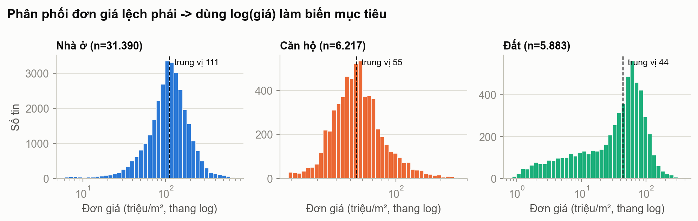
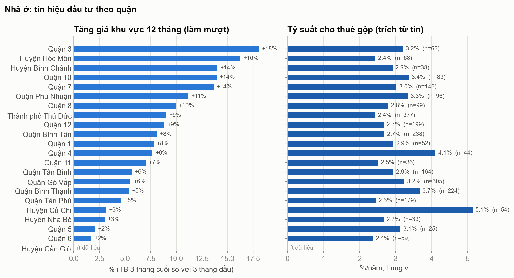

# Bất động sản TP.HCM – Thu thập & Tiền xử lý dữ liệu Nhà Tốt

Phần **thu thập và chuẩn bị dữ liệu** cho đồ án Data Science *"Dự đoán giá, xác định bất thường giá cho nhà ở"* (Trung tâm Tin học – ĐH KHTN TP.HCM), dùng dữ liệu tin rao bán trên [Nhà Tốt](https://www.nhatot.com/) / [Chợ Tốt](https://www.chotot.com/).

- **Bài toán 1:** dự đoán giá nhà (hồi quy; ≥ 4 mô hình ở cả sklearn và PySpark)
- **Bài toán 2:** phát hiện tin rao giá quá thấp / quá cao (điểm tổng hợp từ 4 tín hiệu: Residual-Z, Min/Max, P10–P90, Isolation Forest)
- **Phạm vi dữ liệu:** 22 quận/huyện TP.HCM (đề chỉ cấp 3 quận; thu thập thêm quận được cộng điểm) · nhà ở là bộ chính, có thêm căn hộ và đất

> Repo **không chứa dữ liệu**. Dữ liệu cào nặng khoảng 1 GB và có thông tin người đăng; dữ liệu mẫu của giảng viên thì chỉ dùng cho học tập.
> Tự tải dữ liệu theo **[HUONG_DAN_LAY_DU_LIEU.md](HUONG_DAN_LAY_DU_LIEU.md)** (khoảng 30 phút).

## Đã làm tới bước nào

Theo quy trình Data Science 6 bước của đề:

| Bước | Trạng thái | Nội dung đã có |
| :--- | :---: | :--- |
| 1. Business Understanding | ✅ Xong | Mục tiêu 2 bài toán, xem [GHI_CHU_TIEN_XU_LY.md](GHI_CHU_TIEN_XU_LY.md) |
| 2. Data Understanding / Acquire | ✅ Xong | Crawler 22 quận + biểu đồ giá 13 tháng theo phường; EDA: thống kê theo quận, tỷ lệ thiếu, biểu đồ trong `reports/` |
| 3. Data Preparation | ✅ Xong | Làm sạch, xử lý thiếu và ngoại lai, tạo đặc trưng, chọn đặc trưng; bộ train/test cho bài toán 1; bộ dữ liệu + tín hiệu S2, S3 cho bài toán 2 |
| 4. Modeling | ⏳ Chưa làm | Dữ liệu đã sẵn sàng: `data/model_ready/`, `data/anomaly_ready/`, `pyspark_prep/`. Chưa huấn luyện mô hình |
| 5. Evaluation | ⏳ Chưa làm | Đã có sẵn: tập test cố định, nhãn tham chiếu cho bài toán 2, hàm tính S1 / S4 / điểm tổng hợp |
| 6. Deployment | ⏳ Chưa làm | — |

Chi tiết phần đã xong:

| Hạng mục | Trạng thái | Ghi chú |
| :--- | :---: | :--- |
| Cào dữ liệu 22 quận | ✅ | 47.928 tin thô, 0 trang lỗi |
| Làm sạch + đặc trưng | ✅ | 43.490 tin sạch (nhà ở 31.390) |
| Bài toán 1 – train/test sklearn | ✅ | Điền thiếu + mã hóa fit trên train; `split.csv` |
| Bài toán 1 – tiền xử lý PySpark | ✅ Viết xong | `pyspark_prep/chuan_bi_spark.py` (xem ghi chú chạy thử ở cuối README) |
| Bài toán 2 – S2 Min/Max, S3 P10–P90 | ✅ | Đã tính cho từng tin |
| Bài toán 2 – S1 Residual-Z, S4 Isolation Forest | 🟡 Chuẩn bị sẵn | Cần mô hình giá (bước 4); đã có cột `if_*` và các hàm tính |
| Xử lý riêng 3 file mẫu của giảng viên | ✅ | `xu_ly_du_lieu_mau/`, 7.256 tin sạch |
| Kiểm tra nhanh dữ liệu | ✅ | Mô hình mặc định: R² (log giá) nhà ở 0,87; 3 file mẫu 0,85 |
| Ghi chú, danh mục biến, slide | ✅ | `GHI_CHU_TIEN_XU_LY.md`, `BAO_CAO_TIEN_XU_LY.md`, `slides/tien_xu_ly.pdf` |

## Chạy như thế nào

```bash
git clone https://github.com/dqphong0302/chi-project.git
cd chi-project
python3 -m venv .venv && source .venv/bin/activate   # Windows: .venv\Scripts\activate
pip install -r requirements.txt
```

Có 2 lựa chọn, tùy yêu cầu của giảng viên:

**A. Dữ liệu cào 22 quận** (cần Internet, khoảng 30 phút):

```bash
python run_pipeline.py
```

Lệnh này chạy lần lượt các bước dưới đây. Mỗi bước cũng chạy riêng được bằng `--mode`:

| # | Bước | `--mode` riêng | Đầu ra |
| :--- | :--- | :--- | :--- |
| 1 | Cào tin rao 22 quận | `crawl-only` | `data/raw/<run_id>/` |
| 2 | Tải biểu đồ giá 13 tháng | `market-price` | `data/raw/<run_id>/market_price_charts.json` |
| 3 | Tiền xử lý (làm sạch, sửa lỗi, đặc trưng, tín hiệu S2/S3) | `preprocess-only` (chạy luôn 4–6) | `data/processed/` |
| 4 | Bài toán 1: train/test + điền thiếu + mã hóa | `model-prep` (chạy luôn 5–6) | `data/model_ready/<loại>/` |
| 5 | Bài toán 2: bộ dữ liệu phát hiện bất thường | (cùng bước 4) | `data/anomaly_ready/<loại>/` |
| 6 | Thống kê + biểu đồ | `report-only` (chỉ in thống kê) | `reports/` |

Sau đó, nếu làm bằng PySpark:

```bash
pip install pyspark            # cần Java 17 hoặc 21
python pyspark_prep/chuan_bi_spark.py --dir data/model_ready/nha_o
```

**B. Chỉ 3 file mẫu của giảng viên** (không cần cào): chép 3 file CSV vào `Cung cap HV/`, rồi chạy

```bash
python xu_ly_du_lieu_mau/xu_ly.py
python pyspark_prep/chuan_bi_spark.py --dir data/du_lieu_mau/model_ready   # nếu làm PySpark
```

Chi tiết: [xu_ly_du_lieu_mau/README.md](xu_ly_du_lieu_mau/README.md).

## Kết quả lần chạy 25/09/2026

| | Dữ liệu cào 22 quận | 3 file mẫu |
| :--- | :--- | :--- |
| Tin thô → tin sạch | 47.928 → **43.490** (nhà ở 31.390 · căn hộ 6.217 · đất 5.883) | 8.273 → **7.256** |
| Train / test (nhà ở) | 25.214 / 6.087, chia theo người đăng | 5.802 / 1.450, chia ngẫu nhiên theo quận |
| Kiểm tra nhanh nhà ở (mô hình mặc định, tập test) | R² log giá 0,87 · MAE 1,87 tỷ · sai số trung vị 14% | R² log giá 0,85 · MAE 1,44 tỷ · sai số trung vị 12% |
| Bài toán 2 (nhà ở) | 31.567 tin; S2 vi phạm 610; nhãn Chợ Tốt 146 | 7.256 tin; S2 vi phạm 50 |

<p align="center">
  <br>
  
</p>

## Dùng dữ liệu cho bước mô hình

**Bài toán 1 – sklearn:**

```python
import json, numpy as np, pandas as pd

d = "data/model_ready/nha_o/"              # hoặc data/du_lieu_mau/model_ready/
feats = json.load(open(d + "features.json"))["feature_names_out"]
train, test = pd.read_parquet(d + "train.parquet"), pd.read_parquet(d + "test.parquet")
X_train, y_train = train[feats], train["target_log_price"]
X_test, y_test = test[feats], test["target_log_price"]
# ... model.fit(X_train, y_train); pred = model.predict(X_test)
# Đánh giá MAE / RMSE theo tỷ đồng: np.exp(pred) so với np.exp(y_test)
```

**Bài toán 1 – PySpark:** đọc `data/model_ready/nha_o/spark/train.parquet` và `test.parquet` (cột `features`, `label`) sau khi chạy `pyspark_prep/chuan_bi_spark.py`. Tập test giống hệt bên sklearn.

**Bài toán 2:**

```python
import pandas as pd
from sklearn.ensemble import IsolationForest
from src.anomaly_prep import residual_z_score, isolation_forest_score, composite_score

a = pd.read_parquet("data/anomaly_ready/nha_o/anomaly.parquet")      # hoặc data/du_lieu_mau/anomaly_ready/
if_cols = [c for c in a.columns if c.startswith("if_")]

# S1: cần mô hình giá của bài toán 1, dự đoán log giá cho mọi dòng của `a`
# s1 = residual_z_score(a["target_log_price"], y_hat_log, train_mask=(a["split"] == "train").values)
s4 = isolation_forest_score(IsolationForest(random_state=42).fit(a[if_cols]).decision_function(a[if_cols]))
# score = composite_score(s1, a["s2_minmax"], a["s3_percentile"], s4, weights=(0.4, 0.2, 0.2, 0.2))
# Top-k%: a.assign(score=score).nlargest(int(0.05 * len(a)), "score"); a["price_side"] cho biết quá thấp / quá cao
# Tham khảo đánh giá: a["label_chotot_invalid_price"] (tin Chợ Tốt đánh dấu giá không hợp lệ)
```

## Cấu trúc

```
chi-project/
├── run_pipeline.py              # Điểm chạy chính (dữ liệu cào 22 quận)
├── src/
│   ├── config.py                # 22 quận, bảng giải mã, ngưỡng làm sạch
│   ├── crawler.py               # Cào tin rao (API ad-listing)
│   ├── market_price.py          # Biểu đồ giá 13 tháng theo phường
│   ├── storage.py               # Lưu/đọc từng lần cào, nhật ký snapshot
│   ├── preprocessor.py          # Trích xuất, làm sạch, sửa lỗi, đặc trưng
│   ├── anomaly_signals.py       # Tín hiệu S2 Min/Max, S3 P10–P90
│   ├── model_prep.py            # Bài toán 1: train/test, điền thiếu, mã hóa
│   ├── anomaly_prep.py          # Bài toán 2: bộ dữ liệu + hàm S1, S4, điểm tổng hợp
│   ├── analyzer.py              # Thống kê theo quận × loại BĐS
│   └── figures.py               # Biểu đồ
├── pyspark_prep/                # Tiền xử lý phía PySpark (dùng chung train/test)
├── xu_ly_du_lieu_mau/           # Xử lý riêng 3 file mẫu của giảng viên
├── reports/                     # Thống kê tổng hợp + biểu đồ (có trong repo)
├── slides/tien_xu_ly.pdf        # Slide báo cáo tiền xử lý
├── GHI_CHU_TIEN_XU_LY.md        # Nhật ký quyết định tiền xử lý (làm gì, vì sao, bao nhiêu dòng)
├── BAO_CAO_TIEN_XU_LY.md        # Danh mục biến chi tiết
├── HUONG_DAN_LAY_DU_LIEU.md     # Hướng dẫn tải dữ liệu
└── data/                        # (tạo ra khi chạy, không có trong repo)
```

## Lưu ý

- Giá trong dữ liệu là **giá rao bán**, không phải giá giao dịch thật.
- Các cột `grp_*`, `s2_*`, `s3_*`, `price_side`, `price_per_m2` tính từ chính giá bán: **không dùng làm biến đầu vào** cho mô hình dự đoán giá.
- Dữ liệu lấy từ API công khai của Chợ Tốt, chỉ phục vụ học tập / nghiên cứu. Crawler có nghỉ giữa các request; vui lòng không giảm thời gian nghỉ.
- Biên dịch slide: `cd slides && tectonic tien_xu_ly.tex` (hoặc `xelatex`). Slide dùng font Arial.
- **Trạng thái chạy thử PySpark:** `pyspark_prep/chuan_bi_spark.py` đã viết xong nhưng **chưa chạy thử được trên máy phát triển** (đang tải PySpark). Mục này sẽ được cập nhật sau khi chạy thử.
